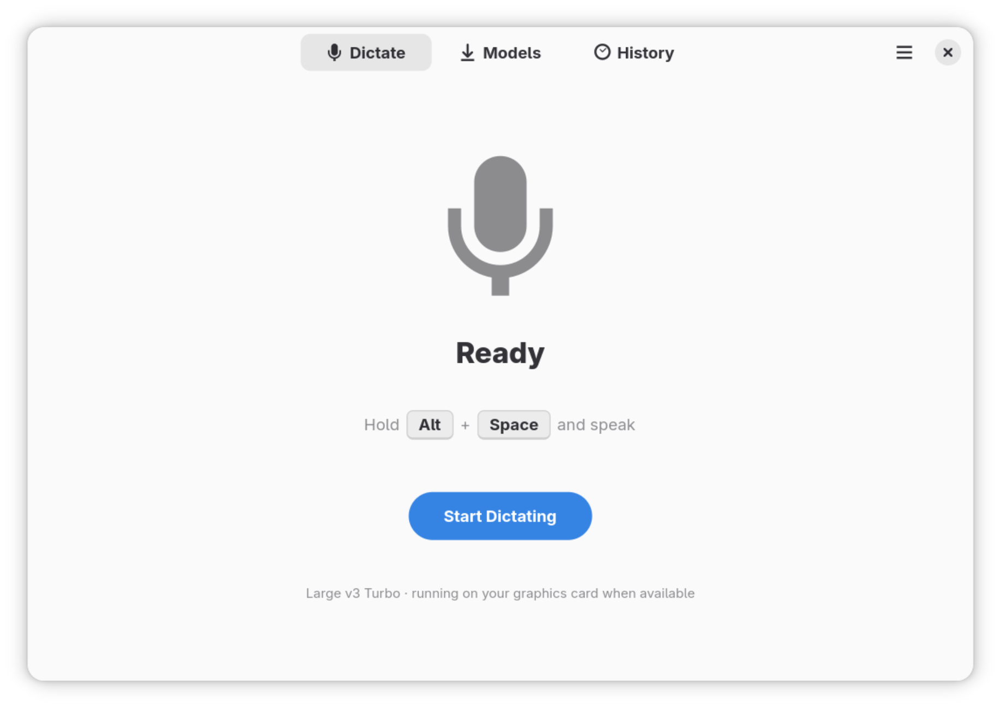

<div align="center">


# Scribe

**Dictate anywhere on your GNOME desktop.**
Hold a keyboard shortcut, speak, and Scribe types what you said
into whatever application you were using.

[](https://github.com/tduarte/Scribe/actions/workflows/ci.yml)



</div>

Transcription runs entirely on your own machine with
[whisper.cpp](https://github.com/ggml-org/whisper.cpp), GPU-accelerated through
Vulkan. Nothing you say leaves the computer, and once a model is downloaded
Scribe works completely offline.

## Performance

Measured on an AMD Radeon RX 9070 XT (RDNA4, `gfx1201`, RADV) with
`large-v3-turbo-q5_0`, transcribing an 11-second clip:

| Backend | Time | Speed |
|---|---|---|
| Vulkan | **0.22 s** | 50x realtime |
| CPU (Ryzen 9 9900X) | 9.47 s | 1.2x realtime |

Vulkan is worth roughly a **43x speedup** on this model, which is what makes the
larger, more accurate models usable for dictation. Note the reverse holds for
`tiny`: it is so small that dispatch overhead dominates and the CPU is slightly
faster, so the GPU only starts paying off from `small` upwards.

## Requirements

- GNOME 48 or newer (the GlobalShortcuts portal landed in 48; developed against 50)
- Wayland
- A GPU with Vulkan for acceleration — otherwise it falls back to the CPU

## Building

```bash
flatpak install flathub org.gnome.Platform//50 org.gnome.Sdk//50
flatpak-builder --user --install --force-clean build build-aux/scribe-dev.yaml
flatpak run io.github.tduarte.Scribe
```

The first run asks which speech model to download. Models are stored in
`~/.var/app/io.github.tduarte.Scribe/data/models/` and verified by sha256.

## Using it

Hold your shortcut, speak, release. A rising chime means Scribe is listening and
a falling one means it is transcribing; GNOME also shows its own microphone
indicator in the top bar while recording.

There is no floating overlay, because GNOME cannot host one — see
[docs/PORTAL-FINDINGS.md](docs/PORTAL-FINDINGS.md). Scribe appears under
**Quick Settings → Background Apps** with its current state instead, which is
also where you can quit it.

## Notable behaviour worth knowing

- **GNOME never sends a key-up for global shortcuts.** It forwards keyboard
  auto-repeat as repeated `Activated` signals and no `Deactivated` at all, so
  "release" is reconstructed from the timing. Details and measurements in
  [docs/PORTAL-FINDINGS.md](docs/PORTAL-FINDINGS.md).
- **Text is pasted, not typed.** mutter resolves synthetic keysyms against your
  active keyboard layout and silently drops anything not on it, which truncates
  transcriptions at the first accented character. Pasting carries arbitrary
  Unicode intact.
- **Consent is asked once.** The RemoteDesktop grant is persisted with a restore
  token, so dictation does not prompt every session.

## Development

```bash
python3 -m venv --system-site-packages .venv && .venv/bin/pip install pytest
.venv/bin/python -m pytest tests -q
```

The portal spikes in `spikes/` are runnable against a built Flatpak and are how
the findings above were established:

```bash
flatpak run --command=spike-shortcuts io.github.tduarte.Scribe
flatpak run --command=spike-inject    io.github.tduarte.Scribe both
```

## Licence

GPL-3.0-or-later. Whisper models are downloaded from
[ggerganov/whisper.cpp](https://huggingface.co/ggerganov/whisper.cpp) and carry
their own licences.
